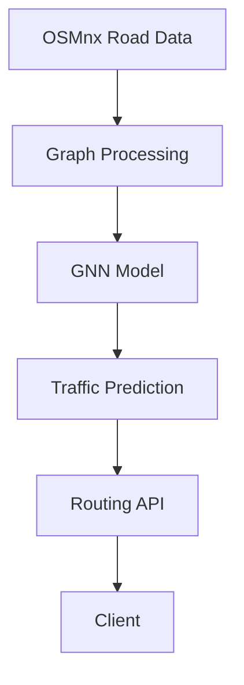
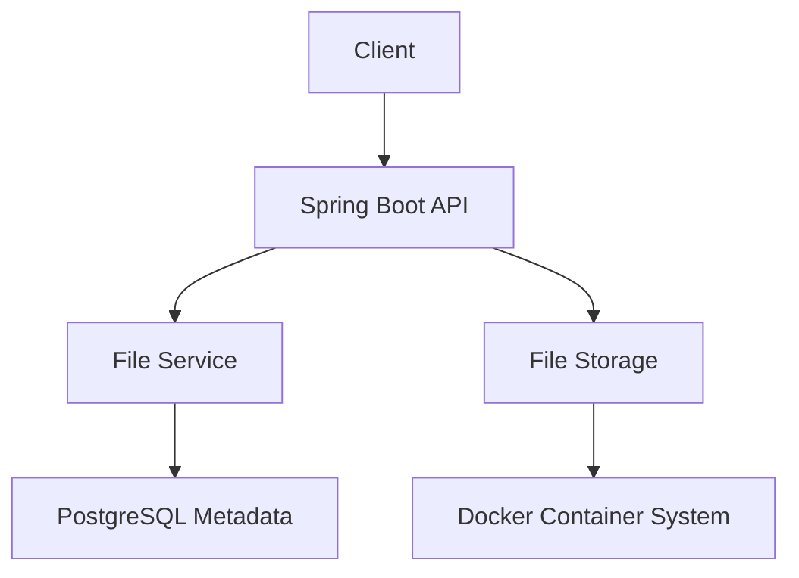
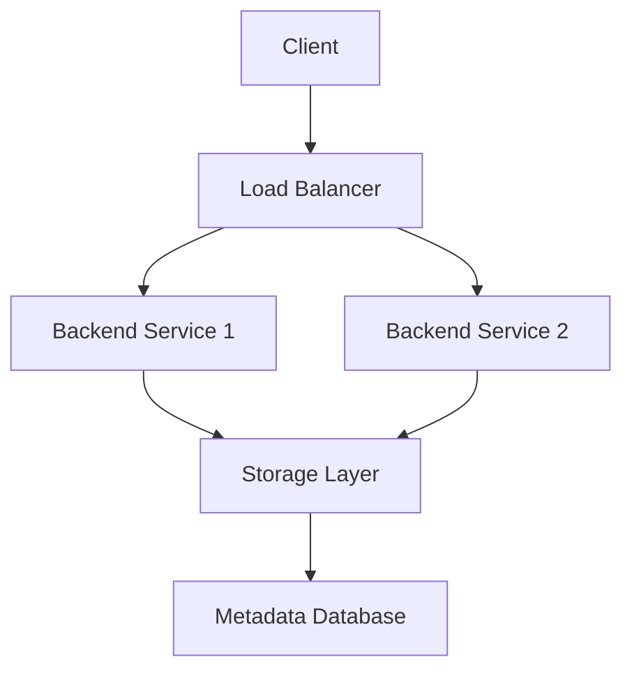

---

<!-- ================= CYBERPUNK PRO README ================= -->

<!-- ===== DARK CYBERPUNK HEADER ===== -->
<p align="center">
  
</p>

<!-- ===== Typing Effect (Dark Purple) ===== -->
<p align="center">
  
</p>

---

# 👋 Hello World, I'm Kurmanzhan

🧠 **AI Engineer**  
⚙️ **Backend Developer**  
☁️ **Building Scalable Systems**

---

## 🌌 Professional Identity

⚡ Designing intelligent systems  
🚀 Building scalable backends  
🔥 Optimizing performance  

---

## ⚡ Core Focus

✨ Artificial Intelligence  
✨ Backend Engineering  
✨ System Design  
✨ Distributed Systems  

---

## 🛠 Technical Skills

### 👨‍💻 Programming

<p align="center">
  
</p>

---

### ⚙️ Backend

<p align="center">
  
</p>

---

### 🗄 Databases

<p align="center">
  
</p>

---

### 🧠 AI / ML

<p align="center">
  
</p>

**GNN • LSTM • NLP • ML Pipelines**

---

### ☁️ DevOps

<p align="center">
  
</p>

---

# 🚀 Featured Projects

## 🚦 Smart Traffic Prediction System


## ☁️ Cloud File Storage System

### 🧩 Architecture


## URL Shortener (System Design)
### 🧩 Architecture

```mermaid
graph TD
A[Client] --> B[API Gateway]
B --> C[URL Service]
C --> D[Cache (Redis)]
C --> E[Database]
D --> C
```
## 📦 Scalable File Storage
### 🧩 Architecture


### 🚗 Uber-like Ride Matching System

```mermaid
graph TD
A[User App] --> B[API Gateway]
B --> C[Ride Service]
B --> D[Driver Service]

C --> E[Matching Engine]
D --> E

E --> F[Real-Time Location (Redis)]
E --> G[Database]

F --> E
```
