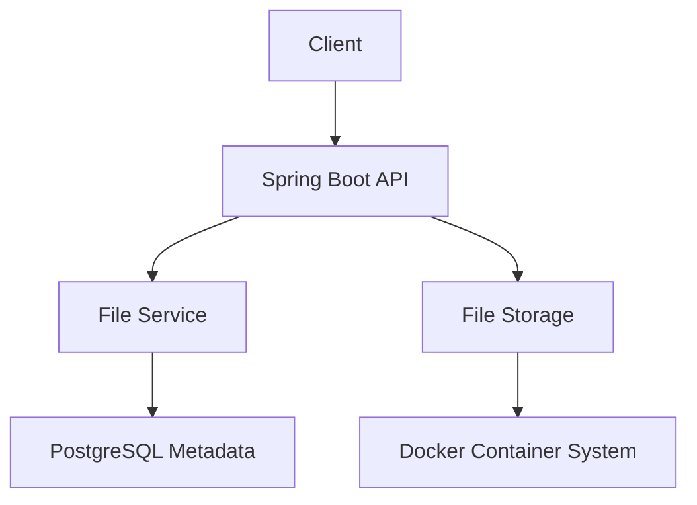
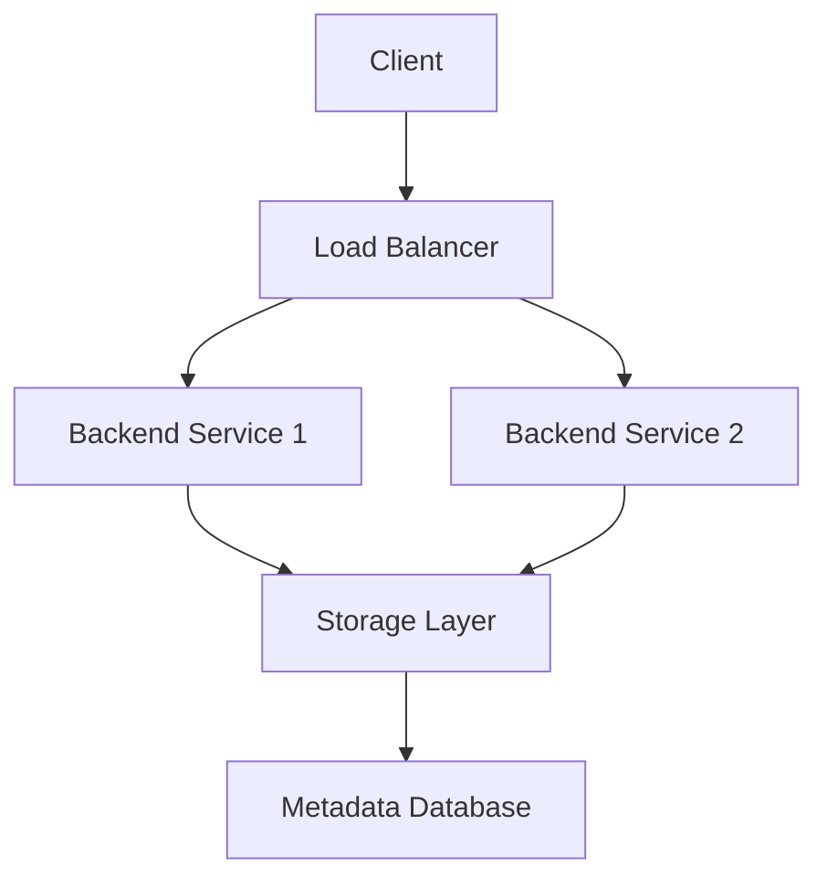

<!-- ===== ELITE HEADER ===== -->
<p align="center">
  
</p>

<p align="center">
  
</p>

---

# 👋 Hi, I'm Kurmanzhan

**AI Engineer & Backend Developer focused on scalable systems, real-world data, and performance.**

---

## 🧠 Engineering Focus

- AI systems (GNN, NLP, ML pipelines)
- Backend architecture & API design
- Distributed systems & scalability
- Performance optimization

---

## ⚙️ Tech Stack

**Languages:** `Java` `Python` `SQL`  
**Backend:** `Spring Boot` `FastAPI` `Django`  
**Databases:** `PostgreSQL` `MongoDB` `Neo4j`  
**AI/ML:** `PyTorch` `Scikit-learn` `Pandas`  
**DevOps:** `Docker` `Nginx` `Linux`

---

# 🚀 Featured Projects

## 🚦 Smart Traffic Prediction System

### 🧩 Architecture

```mermaid
graph TD
A[OSMnx Road Data] --> B[Graph Processing (NetworkX)]
B --> C[GNN Model (PyTorch)]
C --> D[Traffic Prediction Engine]
D --> E[Dynamic Routing API]
E --> F[Client Application]
```

### 🌐 Demo
👉 (Deploy on Render / Railway and put link here)

### 📈 Engineering Metrics
- Reduced simulated travel time by ~25%
- Handled graph with 10k+ nodes
- Optimized routing recalculation latency

---

## ☁️ Cloud File Storage System
### 🧩 Architecture



## 🔹 Scalable File Storage

### 🧩 Architecture



# 🏆 Engineering Achievements

- Built **graph-based AI system (GNN)**
- Designed **scalable backend architectures**
- Developed **end-to-end ML pipelines**
- Hands-on with **real-world datasets**

---

# 📊 GitHub Stats

<p align="center">
  
  
</p>

---

# 🧠 Problem Solving

<p align="center">
  <a href="https://leetcode.com/u/4s3Z7GrZge/">
    
  </a>
</p>

---

# 🎯 Current Focus

- System Design Interviews
- Cloud (AWS / GCP)
- AI in production systems
- Backend performance optimization

---

# 🌐 Contact

- 📧 daniiarbekkyzyk@gmail.com  
- 💼 LinkedIn: https://www.linkedin.com/in/kurmanzhan-daniiarbek-kyzy/  
- 💻 GitHub: https://github.com/Daniikur  

---

# ⚡ Philosophy

> Build systems that scale. Not just code that works.
